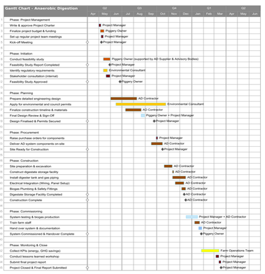
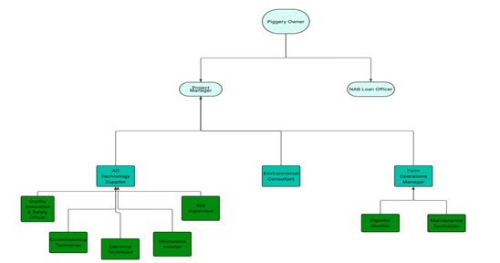

## 📅 Project Timeline

The project follows a structured timeline from planning through to commissioning, ensuring clear milestones and controlled execution across all phases.

---

## 👥 Project Structure

A clearly defined organisational structure ensures effective coordination between stakeholders, technical teams, and decision-makers throughout the project lifecycle.
