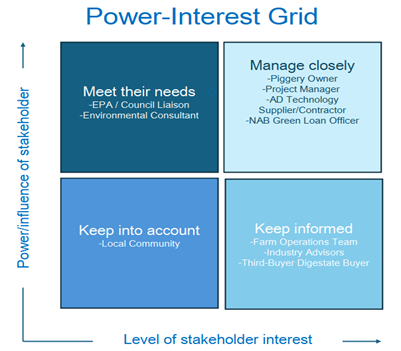
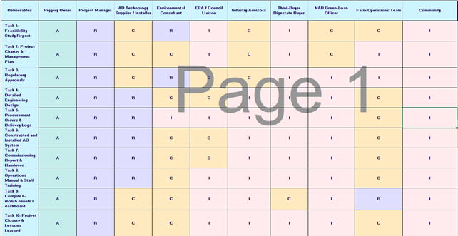

## 📅 Project Timeline

The project follows a structured timeline from planning through to commissioning, ensuring clear milestones and controlled execution across all phases.

---

## 👥 Project Structure

A clearly defined organisational structure ensures effective coordination between stakeholders, technical teams, and decision-makers throughout the project lifecycle.

---

## 🧠 Stakeholder Analysis

Stakeholders were classified based on their level of influence and interest, enabling targeted engagement strategies and effective communication.

---

## 📊 Governance & Responsibilities

A RACI framework was used to define roles and responsibilities, ensuring accountability and clarity across all project activities.
